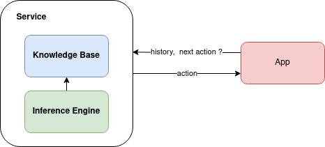

# Vietnamese Symptom Checker
This is a rule-based approach for Vietnamese Symptom Checker



### Quick start
```
pip install -r requirements.txt
python main.py

From 30 symptoms, database has 223 disease
Reading weight from data/weight/disease_symptom_weight_random.csv
Xin hãy nhập triệu chứng nào bạn cảm thấy rõ nhất:ho
Bạn có bị Khó thở không ? (y/n/idk):y
Bạn có bị Đau đầu không ? (y/n/idk):n
Bạn có bị Mệt mỏi không ? (y/n/idk):y
Bạn có bị Sốt không ? (y/n/idk):y

Possible disease:
Nhiễm nấm Histoplasma (vi nấm histoplasma)
Covid
Ung thư phế quản phổi nguyên phát
Ung thư lá lách
Sốt siêu vi
{'symptom': ['Ho', 'Khó thở', 'Mệt mỏi', 'Sốt'], 'triage': 'Bạn cần phải đến phòng khám/bệnh viện sớm nhất có thể', 'possible_disease': [{'name': 'Nhiễm nấm Histoplasma (vi nấm histoplasma)', 'confidence': 16}, {'name': 'Covid', 'confidence': 16}, {'name': 'Ung thư phế quản phổi nguyên phát', 'confidence': 12}, {'name': 'Ung thư lá lách', 'confidence': 12}, {'name': 'Sốt siêu vi', 'confidence': 12}], 'asked_symptom': ['Ho', 'Khó thở', 'Đau đầu', 'Mệt mỏi', 'Sốt']}
```

### Data
Symptom-Disease weights are automated generated and saved in `data/weight/`

### Examples
tbd

### Todo
- Deeper question:
    + If disease has same category: --> ask question y = f(possible disease, category)
- Get next symptom based on more weight:
    + symptom-disease reputation: common/uncommon
- Suggested doctor