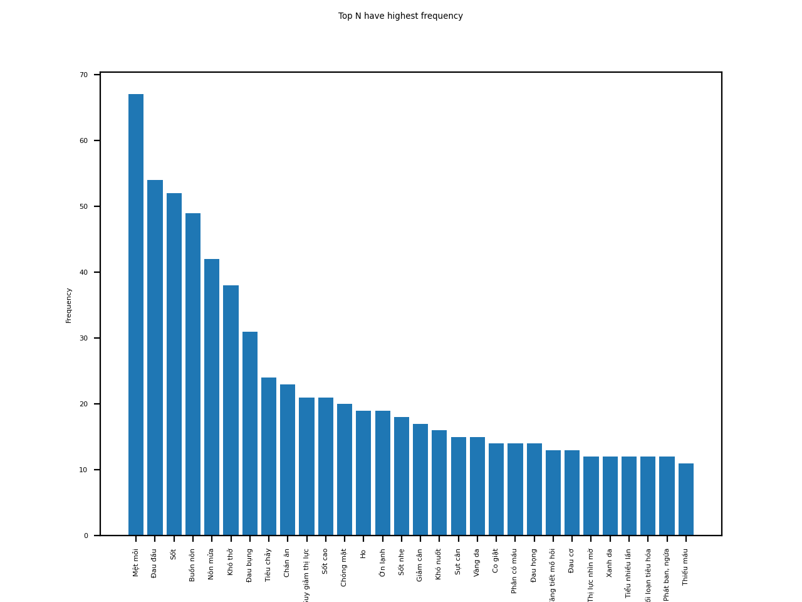
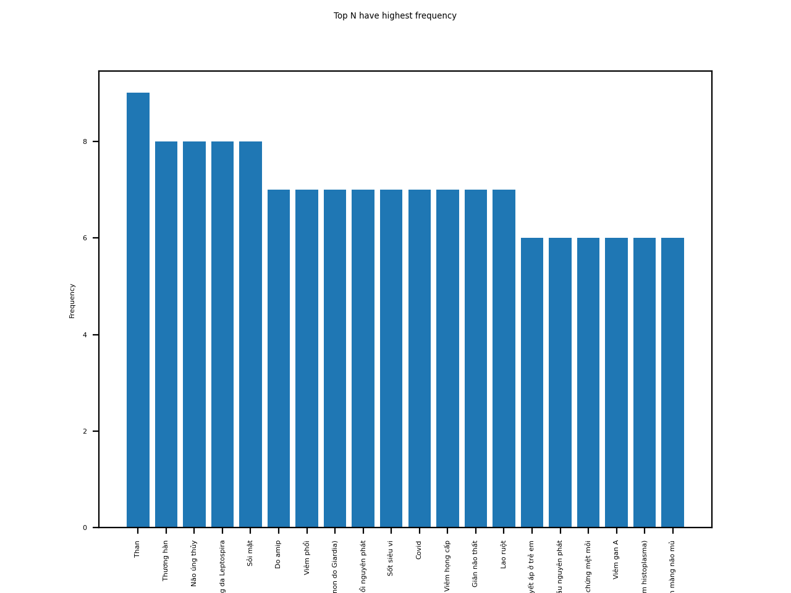

# Data Analysis

```
python main.py

Top-30 common symptoms and its 20 relevant common disease
{'Mệt mỏi': 67, 'Đau đầu': 54, 'Sốt': 52, 'Buồn nôn': 49, 'Nôn mửa': 42, 'Khó thở': 38, 'Đau bụng': 31, 'Tiêu chảy': 24, 'Chán ăn': 23, 'Suy giảm thị lực': 21, 'Sốt cao': 21, 'Chóng mặt': 20, 'Ho': 19, 'Ớn lạnh': 19, 'Sốt nhẹ': 18, 'Giảm cân': 17, 'Khó nuốt': 16, 'Sụt cân': 15, 'Vàng da': 15, 'Co giật': 14, 'Phân có máu': 14, 'Đau họng': 14, 'Tăng tiết mồ hôi': 13, 'Đau cơ': 13, 'Thị lực nhìn mờ': 12, 'Xanh da': 12, 'Tiểu nhiều lần': 12, 'Rối loạn tiêu hóa': 12, 'Phát ban, ngứa': 12, 'Thiếu máu': 11}
['Cường lách', 'Cao huyết áp ở trẻ em', 'Đa hồng cầu nguyên phát', 'Thiếu máu do thiếu sắt', 'Tiểu đường', 'Bệnh Rubella', 'Hội chứng mệt mỏi', 'Thương hàn', 'Đau nửa đầu', 'Vô kinh', 'Viêm gan A', 'Ung thư phổi', 'Giun chỉ', 'Hodgkin', 'Nhiễm nấm Histoplasma (vi nấm histoplasma)', 'Viêm màng não mủ', 'Máu nhiễm mỡ', 'Viêm xương tai chũm', 'Do amip', 'Giãn phế quản']
```


### Top 30 common symptoms


### Top 20 relevant common disease
